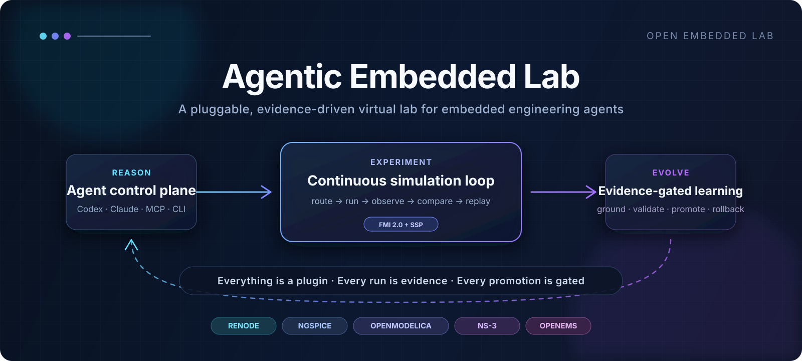
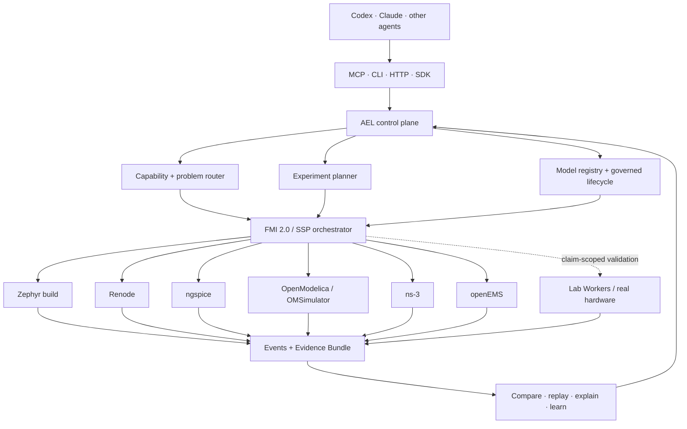
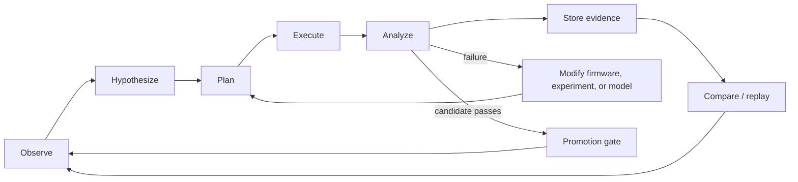

<div align="center">
  

  <h3>Agent-native experimentation, modeling, and validation for embedded systems</h3>

  <p>
    <a href="https://github.com/eust-w/agentic-embedded-lab/releases/tag/v0.2.0.dev0"></a>
    <a href="docs/production-readiness.md"></a>
    <a href="docs/production-readiness.md"></a>
    
    
    
    <a href="LICENSE"></a>
  </p>

  <p>
    <a href="#why-ael">Why AEL</a> ·
    <a href="#quick-start">Quick start</a> ·
    <a href="#architecture">Architecture</a> ·
    <a href="#everything-is-a-plugin">Plugins</a> ·
    <a href="#continuous-simulation-in-the-loop">Continuous simulation</a> ·
    <a href="#controlled-learning-and-self-evolution">Controlled evolution</a> ·
    <a href="docs/mcp.md">MCP</a> ·
    <a href="docs/vision.md">Vision</a>
  </p>

  <p><b>English</b> | <a href="README.zh-CN.md">简体中文</a></p>
</div>

> [!IMPORTANT]
> AEL is currently a **`0.2.0.dev0` Development Preview**. The software and
> simulation gates have passed in a qualified environment, but no current
> five-board differential or instrument-calibration evidence exists. A
> simulator pass is never promoted into a hardware-equivalence claim.

## Why AEL

Embedded engineering does not live inside one codebase or one simulator. A
single failure can cross firmware, RTOS scheduling, peripheral protocols,
power integrity, thermal behavior, wireless networks, RF, and electromagnetic
geometry. Agents need more than shell access: they need a lab that knows what
can be executed, what was observed, and what the result is allowed to prove.

**Agentic Embedded Lab (AEL)** is that control plane. It turns agent intent into
typed experiments, routes each part to explicit execution backends, coordinates
multi-rate simulation, and stores replayable evidence with fidelity boundaries.

| | Conventional tool automation | Agentic Embedded Lab |
|---|---|---|
| Agent interface | Arbitrary shell and simulator commands | Nine domain-level MCP tools plus CLI/HTTP/SDK |
| Execution | Tool-specific scripts | Capability-routed, pluggable backends |
| Time | Independent simulator clocks | FMI 2.0 / SSP multi-rate coordination |
| Results | Logs and screenshots | Hashed Evidence Bundles, events, assertions, snapshots |
| Missing capability | Mock, skip, or fail late | Explicit gap; no silent fallback |
| Learning | Prompt memory or unreviewed patches | Grounded candidates, regression, promotion gates, rollback |
| Claims | “Simulation passed” | Claim + model version + fidelity + Validation Envelope |

> **Design mantra:** Everything is a plugin. Every run is evidence. Every
> promotion is gated.

## What works today

- Strict versioned contracts for problems, systems, experiments, models,
  validation envelopes, events, claims, and evidence.
- Capability-aware routing across Zephyr builds, Renode, ngspice,
  OpenModelica/OMSimulator, ns-3, openEMS, local control-plane tests, and
  hardware-validation workers.
- Deterministic multi-rate scheduling, checkpointing, safe-stop behavior, FMI
  2.0 Co-Simulation proxies, SSP export, and event-driven openEMS caching.
- SQLite/local CAS and PostgreSQL/S3-compatible storage with consistent Run,
  Model, Claim, Worker lease, and Evidence semantics.
- CMSIS-SVD and SystemRDL import plus grounded OpenAI/Anthropic structured model
  generation, typed Hardware Behavior IR, Renode C# emission, and an offline OCI
  sandbox boundary.
- Twenty-four faulty/fixed benchmark pairs spanning build, firmware/RTOS,
  digital protocols, power, analog, thermal, network, RF, and EM mechanisms.
- An OIDC/mTLS/Envoy/Worker server topology with lease recovery, cancellation,
  storage outage, migration, and restart acceptance.
- Five reference Lab Worker board definitions and allow-listed instrument
  drivers, intentionally marked **unverified** until physical evidence exists.

## Architecture



The CLI is the behavior source. HTTP and MCP are thin adapters to the same
`AelService`; neither exposes an arbitrary shell, Renode Monitor, raw SCPI, or
paths outside the workspace. See [Architecture](docs/architecture.md),
[Contracts](docs/contracts.md), and [Security](docs/security.md).

## Everything is a plugin

AEL treats the lab as a graph of replaceable capabilities instead of a single
simulator. The current code exposes explicit extension seams; stable out-of-tree
package discovery is a planned public API, not a claim about `0.2.0.dev0`.

| Plugin surface | Responsibility | Current examples |
|---|---|---|
| Agent interface | Translate intent without exposing host power | MCP, CLI, HTTP |
| Problem router | Match problem categories to required capabilities | digital I/O, RTOS, power, RF/EM |
| Execution adapter | Probe, prepare, inject, step, snapshot, stop | Renode, ngspice, Modelica, ns-3, openEMS |
| Model package | Describe executable behavior and provenance | SVD, SystemRDL, Behavior IR, FMU |
| Experiment oracle | Decide a named mechanism outcome | assertion, trace, timing, protocol, waveform |
| Evidence sink | Persist immutable artifacts and event streams | local CAS, S3-compatible object store |
| Worker | Advertise capabilities and execute leased jobs | simulation worker, Lab Worker |
| Instrument driver | Expose allow-listed measurements | power, scope, logic, thermal, RF instruments |
| Policy gate | Control model and Claim promotion | conformance, hardware, production gates |

Backends communicate through the versioned `ael.dev/backend/v1` JSON-lines
protocol. An adapter command or OCI image is administrator-configured; an agent
cannot supply an executable. See [the plugin and evolution vision](docs/vision.md).

## Continuous simulation-in-the-loop

AEL is designed for a lab that keeps running after a single chat turn. A
campaign repeatedly converts observations into experiments, executes the
smallest sufficient fidelity, compares candidates, records regressions, and
queues the next hypothesis.



`0.2.0.dev0` already provides deterministic runs, asynchronous workers,
checkpoint/replay, comparison, evidence storage, and scheduled/nightly
reproduction. The **always-on campaign controller**, experiment-budget policy,
and fleet-scale scheduling are the next layer. They will reuse the same
contracts; they will not bypass fidelity or release gates.

## Controlled learning and self-evolution

“Self-evolving” must not mean “the agent edits a model and declares itself
correct.” AEL uses an evidence-driven, reversible path:

1. **Ground** a candidate in hashed SVD, SystemRDL, datasheet, errata, driver,
   HAL, or reference traces.
2. **Generate** strict Hardware Behavior IR and a receipt without storing API
   keys or untrusted host commands.
3. **Sandbox** generated code with networking off, read-only inputs, and CPU,
   memory, and time limits.
4. **Conformance-test** with independent layout, compile, property, driver, and
   reference-trace checks.
5. **Shadow-run** the candidate against recorded experiments and detect
   regressions before it becomes selectable.
6. **Promote or roll back** through signed model states. An agent may reach only
   `conformance_validated`; hardware and production states require independent
   evidence and a human actor.

This creates continual learning from evidence while preventing self-approval,
silent model substitution, and unbounded production mutation.

## Quick start

Python 3.12 is required.

```bash
git clone https://github.com/eust-w/agentic-embedded-lab.git
cd agentic-embedded-lab

python3.12 -m venv .venv
. .venv/bin/activate
python -m pip install -e '.[dev,mcp,server,worker,modeling]'

ael doctor
ael inspect
ael classify examples/problems/uart-ring-buffer.yaml
ael validate examples/experiments/synthetic-smoke.yaml
ael run examples/experiments/synthetic-smoke.yaml
```

The smoke experiment intentionally uses the test-only `synthetic` backend. Its
Evidence Bundle is marked `synthetic / unverified`; it cannot become a simulator
or hardware Claim.

Run the complete local software acceptance on a qualified Linux/container
environment:

```bash
scripts/run-local-software-acceptance.sh
```

This builds the pinned Zephyr and backend environments, runs all 24 faulty/fixed
pairs, the FMI/SSP five-domain experiment, 20-run determinism, the Compose
recovery topology, and the `simulation` and `software` gates. Missing tools block
the run; no mock replacement is allowed.

## Connect an agent with MCP

```bash
python -m pip install -e '.[mcp]'
AEL_WORKSPACE=/absolute/path/to/agentic-embedded-lab ael-mcp
```

```json
{
  "mcpServers": {
    "agentic-embedded-lab": {
      "command": "/absolute/path/to/.venv/bin/ael-mcp",
      "env": {
        "AEL_WORKSPACE": "/absolute/path/to/agentic-embedded-lab"
      }
    }
  }
}
```

The nine domain tools let an agent inspect, classify, plan, start, query,
compare, generate a missing model, and validate that model. Large event streams
are paged instead of being injected into the agent context. See
[MCP configuration](docs/mcp.md).

## Experimental Aether Native companion

The repository also contains [Aether Native](aether/README.md), an experimental
local desktop shell and plugin-runtime prototype. It is useful for exploring
agent UI, plugin registry, memory, streamed events, and review flows, but it is
not part of the production gate. Provider keys are environment-only, arbitrary
HTTP/Agent shell execution is disabled, and in-process evolution is off by
default.

## Executable benchmark

| Domain | Cases | Mechanisms |
|---|---:|---|
| Build and digital firmware | 1–17 | Kconfig, Devicetree, linker, clock, GPIO, timer, UART, IRQ, DMA, I²C, SPI, RTOS, HardFault, watchdog, OTA |
| Power, analog, thermal | 18–21 | LDO transient, brownout, sleep energy, thermal throttling |
| Network, RF, EM | 22–24 | 802.15.4 interference, Wi-Fi partition, antenna-to-power-to-thermal chain |

Every case includes faulty and fixed assets, an oracle, a deterministic seed,
raw mechanism evidence, a structured causal chain, and an explicit “not proven”
boundary. Digital cases 4–17 currently use a functional firmware mechanism
dispatcher and bridge; they do not establish complete peripheral-register,
RTOS-scheduling, electrical, or silicon equivalence.

## Evidence and release gates

| Gate | Requires | Current status |
|---|---|---|
| `foundation` | contracts, schemas, core tests, C++ proxies | **Passing** |
| `simulation` | 24 mechanism pairs, five backends, FMI/SSP, deterministic traces | **Passing — model-dependent** |
| `software` | simulation + PostgreSQL/S3, OIDC/mTLS, Worker recovery, security and supply-chain evidence | **Passing** |
| `production` | five-board differential evidence, calibrated Validation Envelopes, independent human approval | **Intentionally blocked** |

Claims are scoped to a model version, hardware revision, evidence set, fidelity,
and Validation Envelope. Outside that envelope, the status is `unverified`.
See [Production readiness](docs/production-readiness.md).

## Roadmap

- [x] Strict experiment, evidence, model, and Claim contracts
- [x] Five simulation domains plus Zephyr build and FMI/SSP orchestration
- [x] Agent-facing MCP, server/Worker topology, and governed model generation
- [ ] Stable out-of-tree plugin SDK and signed community registry
- [ ] Always-on simulation campaign controller with budgets and stop policies
- [ ] Regression-driven model selection and evidence-aware experiment curriculum
- [ ] Hardware differential calibration for the five reference platforms
- [ ] Signed Validation Envelopes and production-approved capability packages

Robotics, automotive, IoT, industrial control, medical devices, and other
verticals belong in optional adapters and examples. The core contracts stay
general to embedded systems.

## Contributing and security

Contributions are welcome for adapters, model packages, benchmark mechanisms,
oracles, evidence tooling, and documentation. Start with
[CONTRIBUTING.md](CONTRIBUTING.md). Please report vulnerabilities privately as
described in [SECURITY.md](SECURITY.md); do not include credentials or sensitive
lab details in public issues.

## License

The AEL core is licensed under [Apache-2.0](LICENSE). GPL and other third-party
simulators are not bundled into the core Python distribution; backend images
and adapters retain their upstream license obligations. See
[Third-party notices](THIRD_PARTY_NOTICES.md).

---

<div align="center">
  <b>Build embedded systems with agents — continuously, reproducibly, and within evidence.</b>
</div>
