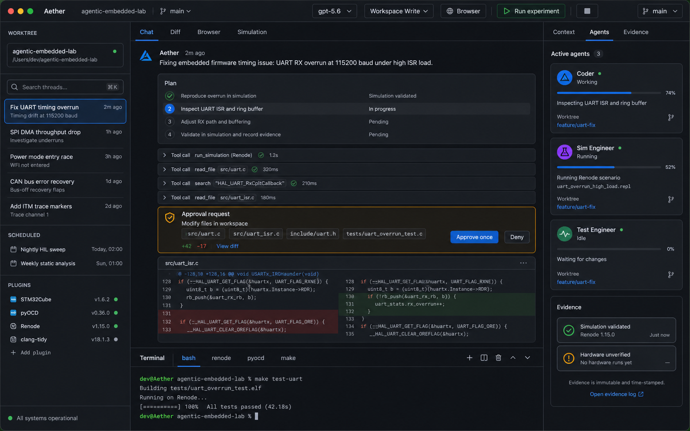

<div align="center">
  
  <h1>Aether Desktop + AEL Engine</h1>
  <p><b>A macOS-native engineering agent and evidence-driven embedded laboratory.</b></p>
  <p>
    
    
    
    
    
    
    <a href="LICENSE"></a>
  </p>
  <p><b>English</b> | <a href="README.zh-CN.md">简体中文</a></p>
</div>

> [!IMPORTANT]
> This branch is the active **Go rewrite toward Aether Desktop 1.0**. Foundation,
> software topology, the complete AEL simulation gate and the ad-hoc-signed arm64
> development bundle pass. The public 1.0 release remains blocked on full Xcode,
> Developer ID/notarization credentials and physical Validation Envelopes.

## Product split

- **Aether Desktop** is the macOS coding-agent experience: threads, approvals,
  terminal, Git/worktrees, subagents, skills, plugins, MCP, memory, browser,
  Computer Use, and background automations.
- **AEL Engine** is the general embedded laboratory: deterministic scheduling,
  virtual hardware, multi-physics backends, evidence, fidelity, claims, and
  validation envelopes.

## Implemented in the Go rewrite

- Wails v2 + React/TypeScript/Vite desktop shell with Chat, Diff, Browser and
  Simulation states matching the checked-in visual specification.
- Versioned `aether.desktop/v1` Thread, Turn, Item, Approval, Agent, Worktree,
  Automation and plugin contracts.
- SQLite WAL event store, content-addressed artifacts, crash-persistent threads,
  memories, permissions, automations and jobs.
- OpenAI Responses streaming client with cancellation, idempotency, structured
  errors and retry/backoff; default model is configurable and starts at `gpt-5.6`.
- macOS Keychain-backed OpenAI credentials and daemon capability token.
- Authenticated Unix-socket `aetherd`, plus Wails-only bindings for the UI.
- Typed permission engine and macOS Seatbelt command preparation; no model-built
  shell command is exposed.
- Git status/diff/stage/restore/commit/push primitives and managed worktrees with
  dirty tracked-patch transfer, plus an offline Monaco Diff workspace and
  read-only AI review threads. Pushes and GitHub draft PR creation are typed,
  explicitly confirmed external writes.
- A real daemon-owned zsh PTY with xterm.js, bounded/paged output, resize,
  cancellation and registered-workspace enforcement.
- Hierarchical `AGENTS.md`, skills, concurrent lifecycle hooks, Ed25519-signed
  plugins, isolated gRPC/WASM processes, sandboxed MCP STDIO/HTTP and opt-in
  local redacted memory.
- Cross-turn conversation restoration and official Responses context management
  compaction for long-running tool-heavy tasks.
- Independent child-agent threads, persisted projects, lease-recovered RRULE
  automation, controlled CDP browser APIs and one-time/persistent Computer Use
  permissions.
- Isolated gRPC process plugins, WASM plugins, a pinned Chromium runtime,
  Chrome Native Messaging and a dynamically loaded Sparkle 2 updater.
- AEL v2 contracts, FMI/SSP orchestration, six execution adapters, 24 real
  faulty/fixed mechanisms, ARM/RISC-V firmware, Evidence/Fidelity and 20-run
  deterministic trace acceptance.

## Remaining release gates

- The local development `.app` is ad-hoc signed. Developer ID signing,
  notarization, Sparkle feed signing and DMG release require full Xcode and the
  release owner's credentials.
- The Chrome Native Messaging installer is shipped but is never installed
  silently; the user must explicitly enable that persistent integration.
- Hardware validation remains unavailable without the physical laboratory.
  Simulation success never creates a hardware or production Claim.

## Development

Required local versions: Go 1.24.x and Node 22 LTS. The current machine can
compile the Go binaries with Command Line Tools; a complete signed `.app` needs
full Xcode.

```bash
npm --prefix frontend install
npm --prefix frontend run build
go test ./...
go vet ./...
go run ./cmd/schema-export --output schemas/v2
./scripts/fetch_macos_dependencies.sh
./scripts/build_mac_app.sh --development
go run ./cmd/aether-package-check
go run ./cmd/ael release check --profile foundation
go run ./cmd/ael release check --profile simulation
go run ./cmd/ael release check --profile software
# Must fail without real hardware evidence:
go run ./cmd/ael release check --profile production
```

Run the frontend visual shell:

```bash
npm --prefix frontend run dev -- --host 127.0.0.1
```

The Wails CLI is pinned to v2.12.0. The app entrypoint is
`cmd/aether-desktop`; the background process is `cmd/aetherd`.

## Data boundary

OpenAI credentials remain in macOS Keychain. Prompts, selected images and tool
results are sent to the configured OpenAI API. Aether enables Responses storage
inside a Turn so `previous_response_id` can continue tool calls; OpenAI project
retention/ZDR policy remains authoritative. Local memories are opt-in, redacted,
inspectable and deletable.

## Evidence boundary

The design intentionally keeps these states separate:

| State | Meaning |
|---|---|
| Software tested | The named Go/React behavior passed its test |
| Simulation validated | A named tool-executed mechanism passed within recorded fidelity |
| Hardware validated | Physical differential evidence passed inside a signed envelope |
| Production approved | Hardware evidence, policy and an independent human approval are present |

The current branch proves the named software, simulation and development-package
checks only. It does not prove physical hardware equivalence. See
[the visual specification](docs/design/aether-desktop-1.0/DESIGN.md) and
[the archived Python implementation](https://github.com/eust-w/agentic-embedded-lab/tree/archive/python-aether-pre-go).

## License

The core is licensed under [Apache-2.0](LICENSE). External simulator containers
retain their upstream license obligations.
