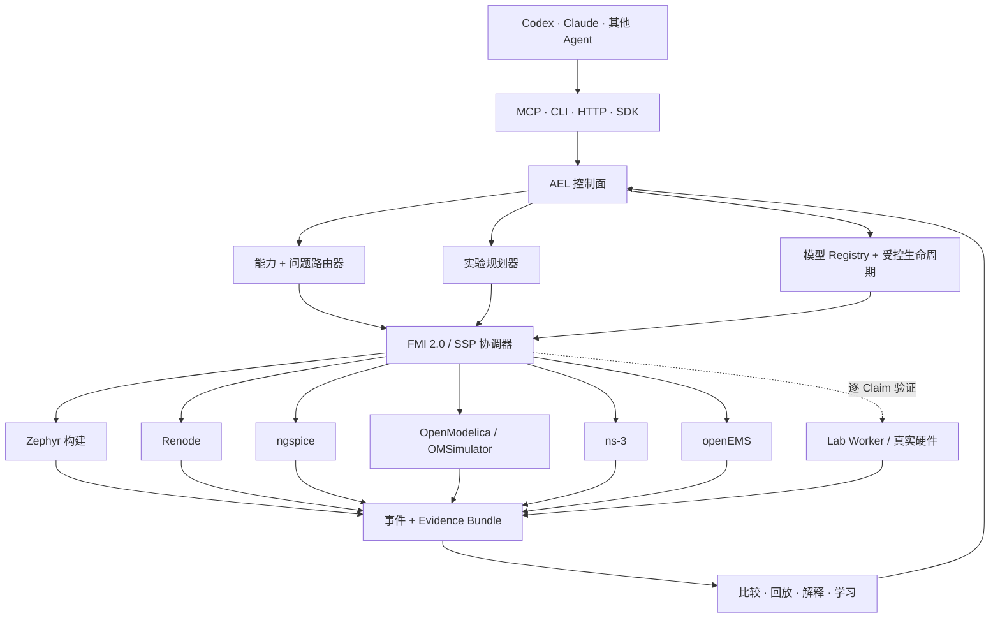
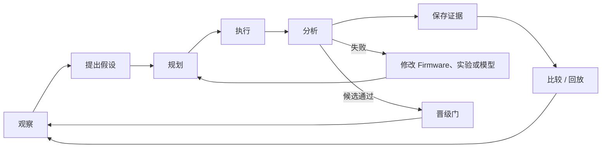

<div align="center">
  

  <h3>面向嵌入式系统的 Agent-native 实验、建模与验证平台</h3>

  <p>
    <a href="https://github.com/eust-w/agentic-embedded-lab/releases/tag/v0.2.0.dev0"></a>
    <a href="docs/production-readiness.md"></a>
    <a href="docs/production-readiness.md"></a>
    
    
    
    <a href="LICENSE"></a>
  </p>

  <p>
    <a href="#为什么需要-ael">为什么需要 AEL</a> ·
    <a href="#快速开始">快速开始</a> ·
    <a href="#总体架构">总体架构</a> ·
    <a href="#一切皆插件">插件体系</a> ·
    <a href="#仿真在环持续运行">持续仿真</a> ·
    <a href="#持续学习与受控自进化">受控自进化</a> ·
    <a href="docs/mcp.md">MCP</a> ·
    <a href="docs/vision.md">项目愿景</a>
  </p>

  <p><a href="README.md">English</a> | <b>简体中文</b></p>
</div>

> [!IMPORTANT]
> AEL 当前是 **`0.2.0.dev0` Development Preview**。软件门和仿真门已经在
> 合格环境中通过，但项目还没有五平台真机差分和仪器校准证据。仿真通过绝不
> 会被自动提升为硬件等价声明。

## 为什么需要 AEL

嵌入式问题不会只存在于一份代码或一个模拟器里。一个故障可能同时跨越
Firmware、RTOS 调度、外设协议、电源完整性、热、无线网络、RF 与电磁结构。
Agent 需要的不只是 Shell，而是一座能够回答三个问题的实验室：什么能执行、
刚才观测到了什么、这个结果究竟允许证明什么。

**Agentic Embedded Lab（AEL）**就是这一层控制面。它把 Agent 意图转换成
强类型实验，把不同部分路由到明确后端，协调多速率联合仿真，并保存带 Fidelity
边界的、可比较和可回放证据。

| | 传统工具自动化 | Agentic Embedded Lab |
|---|---|---|
| Agent 接口 | 任意 Shell 和模拟器命令 | 九个领域 MCP 工具以及 CLI/HTTP/SDK |
| 执行方式 | 每个工具一套脚本 | 能力路由和可插拔后端 |
| 时间模型 | 各自独立时钟 | FMI 2.0 / SSP 多速率协调 |
| 结果 | 日志、截图 | 哈希 Evidence Bundle、事件、断言、快照 |
| 缺失能力 | Mock、跳过或运行后才失败 | 显式缺口，不静默降级 |
| 学习 | Prompt 记忆或未经审查的补丁 | Grounding、回归、晋级门和回滚 |
| 声明 | “仿真通过” | Claim + 模型版本 + Fidelity + Validation Envelope |

> **设计信条：一切皆插件；每次运行都是证据；每次晋级都必须过门。**

## 当前已经可用

- 问题、系统、实验、模型、Validation Envelope、事件、Claim 与 Evidence 的
  严格版本化契约。
- Zephyr 构建、Renode、ngspice、OpenModelica/OMSimulator、ns-3、openEMS、
  控制面测试和硬件 Worker 的能力路由。
- 确定性多速率调度、检查点、安全停止、FMI 2.0 Co-Simulation 代理、SSP
  导出以及事件驱动的 openEMS 缓存。
- SQLite/本地 CAS 与 PostgreSQL/S3 兼容存储，两种模式保持一致的 Run、
  Model、Claim、Worker 租约和 Evidence 语义。
- CMSIS-SVD、SystemRDL 确定性导入，以及有来源约束的 OpenAI/Anthropic
  结构化模型生成、Hardware Behavior IR、Renode C# 生成和离线 OCI 沙箱。
- 24 组 faulty/fixed 基准，覆盖构建、Firmware/RTOS、数字协议、电源、模拟、
  热、网络、RF 和 EM 机制。
- OIDC/mTLS/Envoy/Worker 服务拓扑以及租约恢复、取消、存储中断、迁移和
  重启验收。
- 五种参考板卡和白名单仪器驱动的软件定义；在取得真实证据前始终标记为
  **unverified**。

## 总体架构



CLI 是唯一行为真源。HTTP 和 MCP 都是同一个 `AelService` 的薄适配层，
不会暴露任意 Shell、Renode Monitor、原始 SCPI 或工作区外路径。进一步阅读：
[架构](docs/architecture.md)、[契约](docs/contracts.md)、[安全](docs/security.md)。

## 一切皆插件

AEL 把实验室视为可替换能力构成的图，而不是一个大而全的模拟器。当前代码已
提供明确的扩展接缝；稳定的第三方包自动发现机制仍是后续公开 API，不能把它
误写成 `0.2.0.dev0` 已完成能力。

| 插件面 | 职责 | 当前例子 |
|---|---|---|
| Agent 接口 | 翻译意图但不暴露宿主机权限 | MCP、CLI、HTTP |
| 问题路由器 | 把问题类别映射到能力 | 数字 I/O、RTOS、电源、RF/EM |
| 执行适配器 | probe、prepare、inject、step、snapshot、stop | Renode、ngspice、Modelica、ns-3、openEMS |
| 模型包 | 描述可执行行为和来源 | SVD、SystemRDL、Behavior IR、FMU |
| 实验 Oracle | 判断命名机制是否通过 | 断言、Trace、时序、协议、波形 |
| Evidence Sink | 保存不可变产物和事件 | 本地 CAS、S3 兼容对象存储 |
| Worker | 上报能力并执行租约任务 | Simulation Worker、Lab Worker |
| 仪器驱动 | 只开放白名单测量 | 电源、示波器、逻辑、热、RF 仪器 |
| 策略门 | 控制模型和 Claim 晋级 | Conformance、Hardware、Production |

后端统一使用版本化 `ael.dev/backend/v1` JSON-lines 协议。适配器命令或 OCI
镜像由管理员配置，Agent 无法传入可执行命令。详见
[插件、持续仿真与自进化愿景](docs/vision.md)。

## 仿真在环持续运行

AEL 的目标不是执行完一次聊天就退出，而是让实验室持续循环：从观测提出假设，
选择最低但足够的 Fidelity，执行候选方案，比较结果，保存回归，然后形成下一轮
实验。



`0.2.0.dev0` 已经具备确定性运行、异步 Worker、检查点/回放、比较、证据存储
和定时复现实验。**常驻 Campaign Controller**、实验预算策略和集群级调度是
下一层能力；它们会复用相同契约，不会绕过 Fidelity 和发布门。

## 持续学习与受控自进化

“自进化”不能等于“Agent 修改模型后自己宣布正确”。AEL 采用证据驱动且可回滚
的路径：

1. **Grounding**：候选必须引用已哈希的 SVD、SystemRDL、Datasheet、Errata、
   Driver/HAL 或参考 Trace。
2. **生成**：输出严格 Hardware Behavior IR 和 Generation Receipt，不保存密钥，
   不允许携带任意宿主机命令。
3. **沙箱**：生成代码在断网、只读、CPU/内存/时间受限的 OCI 环境执行。
4. **Conformance**：由独立的布局、编译、属性、驱动和参考 Trace 测试验证。
5. **影子运行**：候选先回放已有实验，检测回归后才允许被实验选择。
6. **晋级或回滚**：Agent 最多推进到 `conformance_validated`；硬件和生产状态
   必须有独立证据和人类批准。

因此平台能够从证据中持续学习，又不会产生自我批准、静默换模或无边界修改生产
系统的问题。

## 快速开始

需要 Python 3.12。

```bash
git clone https://github.com/eust-w/agentic-embedded-lab.git
cd agentic-embedded-lab

python3.12 -m venv .venv
. .venv/bin/activate
python -m pip install -e '.[dev,mcp,server,worker,modeling]'

ael doctor
ael inspect
ael classify examples/problems/uart-ring-buffer.yaml
ael validate examples/experiments/synthetic-smoke.yaml
ael run examples/experiments/synthetic-smoke.yaml
```

`synthetic-smoke` 只验证控制面，Evidence Bundle 会明确标记为
`synthetic / unverified`，不能晋级为模拟器或硬件 Claim。

在合格 Linux/容器环境执行完整软件验收：

```bash
scripts/run-local-software-acceptance.sh
```

脚本会构建锁定版本的 Zephyr 与五个后端，运行 24 组 faulty/fixed、FMI/SSP
五域案例、20 次确定性、Compose 恢复测试，以及 `simulation` / `software`
发布门。缺少工具时会阻塞，不会静默使用 Mock。

## 让 Codex / Claude 接入 MCP

```bash
python -m pip install -e '.[mcp]'
AEL_WORKSPACE=/absolute/path/to/agentic-embedded-lab ael-mcp
```

```json
{
  "mcpServers": {
    "agentic-embedded-lab": {
      "command": "/absolute/path/to/.venv/bin/ael-mcp",
      "env": {
        "AEL_WORKSPACE": "/absolute/path/to/agentic-embedded-lab"
      }
    }
  }
}
```

九个领域工具允许 Agent 检查、分类、规划、启动、查询、比较、生成缺失模型并验证
模型。大规模事件流通过分页读取，不会直接塞满 Agent 上下文。详见
[MCP 配置](docs/mcp.md)。

## 实验性 Aether Native 桌面端

仓库同时包含 [Aether Native](aether/README.md)：一个用于探索 Agent 桌面交互、
插件 Registry、工作记忆、流式事件和 Diff 审阅的实验性本地应用。它不属于
production 发布门；Provider 密钥只从环境变量读取，HTTP/Agent 任意 Shell 已
禁用，同进程自进化默认关闭。

## 证据与发布门

| 发布门 | 要求 | 当前状态 |
|---|---|---|
| `foundation` | 契约、Schema、核心测试、C++ 代理 | **通过** |
| `simulation` | 24 项、五后端、FMI/SSP、确定性 Trace | **通过——模型相关** |
| `software` | simulation + PostgreSQL/S3、OIDC/mTLS、Worker 恢复、安全和供应链证据 | **通过** |
| `production` | 五平台真机差分、校准 Validation Envelope、独立人工批准 | **刻意阻塞** |

所有 Claim 都绑定模型版本、硬件 Revision、证据、Fidelity 和 Validation
Envelope；包络外一律为 `unverified`。详见
[生产就绪边界](docs/production-readiness.md)。

## 路线图

- [x] 严格实验、Evidence、模型和 Claim 契约
- [x] 五个仿真域、Zephyr 构建与 FMI/SSP 联合执行
- [x] Agent MCP、Server/Worker 拓扑和受控模型生成
- [ ] 稳定的第三方插件 SDK 与签名社区 Registry
- [ ] 带预算和停止策略的常驻仿真 Campaign Controller
- [ ] 回归驱动的模型选择和证据感知实验课程
- [ ] 五个平台真机差分校准
- [ ] 签名 Validation Envelope 和 production-approved 能力包

机器人、汽车、IoT、工业控制和医疗等领域应作为可选适配器和示例存在；核心契约
始终保持通用嵌入式抽象。

## 参与贡献与安全

欢迎贡献适配器、模型包、基准机制、Oracle、Evidence 工具和文档。请先阅读
[CONTRIBUTING.md](CONTRIBUTING.md)。安全问题请按 [SECURITY.md](SECURITY.md)
私下报告，不要在公开 Issue 中提交凭证或实验室敏感信息。

## 许可证

AEL 核心使用 [Apache-2.0](LICENSE)。GPL 等第三方模拟器不会捆绑进核心 Python
发行包；后端镜像和适配器保留各自上游许可证义务。详见
[第三方声明](THIRD_PARTY_NOTICES.md)。

---

<div align="center">
  <b>让 Agent 持续、可复现、在证据边界内研发嵌入式系统。</b>
</div>
